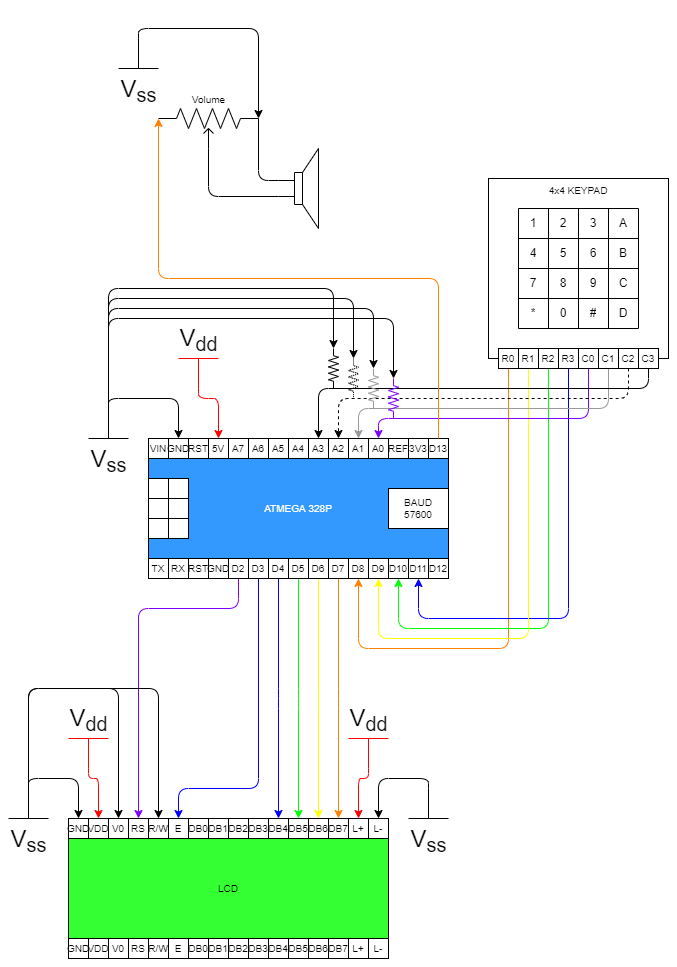

Invisible Alarm
===============

An alarm that wakes you up on time, without showing you the time.

Programmed in C in Atmel Studio for the ATmega328P.

Configuration
-------------

The keypad should connect the rows of the keypad to the lower nibble of port B,
and the columns to the lower nibble of port C.

The LCD display should connect to port D, using D2 as the register select,
D3 as the enable, and D4-D7 for data (LCD Operates in 4 bit mode).

The speaker should be connected to pin B5

Use
---

From the default state, press the following keys to perform various operations.

A: Set Alarm

B: Set Alarm Tune

C: Set Time

D: Test (show alarm time)

Press the hash (#) key to exit a state.